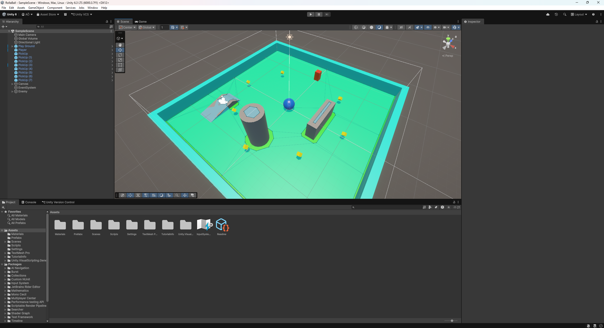
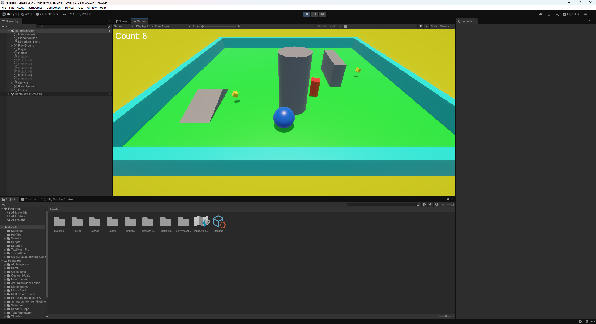

# Blog Post #1: Roll-a-Ball

## Introduction

As part of my Game Development course, I completed the *Roll-a-Ball* tutorial using Unity 6.3. The goal of this tutorial was to learn the basics of working with the Unity engine and understand some of the core systems used in game development. Even though the game itself is simple, it helped me get familiar with the Unity editor, physics, scripting, and basic gameplay mechanics.

The game consists of a ball that the player controls using keyboard input. The objective is to move around the map and collect spinning pickup objects. Once all pickups are collected, the player wins the game.

## Creating the Scene

The first step was setting up the scene. I created a plane to act as the ground and added a sphere that would be used as the player. The sphere was given a Rigidbody component so it could interact with Unity’s physics system and roll naturally across the surface.

I also added several cube objects around the map to serve as pickups. These objects rotate to make them easier to notice while playing.

## Player Movement and Gameplay

To control the ball, I used a C# script that reads player input from the keyboard and applies force to the Rigidbody. This makes the ball roll in the direction of the input rather than simply sliding across the ground.

When the player touches a pickup object, it disappears and the score increases. This was implemented using collision detection with triggers. A UI text element on the screen keeps track of how many pickups the player has collected.

## What I Learned

Working through this tutorial helped me understand how different systems in Unity work together. I learned how to create and organize objects in a scene, attach components like Rigidbody, and use scripts to control gameplay behavior.

One thing that stood out to me was how important physics can be for creating natural movement. Instead of directly moving the player object, using forces made the movement feel much more realistic.

## Conclusion

Overall, the Roll-a-Ball tutorial was a helpful introduction to Unity and game development. It showed how simple mechanics can be combined to create a playable game. While the project is small, it gave me a better understanding of how Unity works and provided a good starting point for more complex projects in the future.
