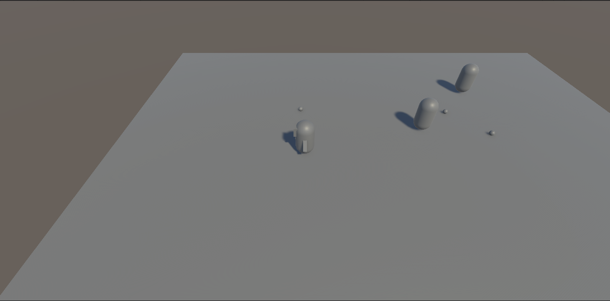
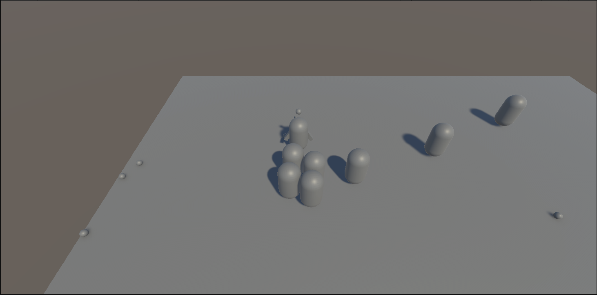

# Blog Post 1 – Creating the Core Gameplay Prototype

## Introduction

In this first development milestone, we focused on building the foundation of our game *Punch*. The goal of this phase was to create a basic playable prototype that demonstrates the core gameplay mechanics and overall direction of the project.

At this stage, the game is still very early in development, but we now have the main systems working together. The player can move around the environment, collect stones, throw them at enemies, and survive against enemy monkeys that chase the player using AI behavior.

---

## Creating the Main Characters

One of the first tasks was creating the basic character props for the game. We created:

- A monkey model for the protagonist, Punch
- Enemy monkey props

The current models are still placeholders and may change later in development, but they help visualize gameplay and test mechanics inside the engine.

---

## Enemy AI and Spawning System

After creating the characters, we implemented a spawning system for enemies. Enemy monkeys spawn into the level automatically and begin chasing the player.

The enemies currently use basic game AI behavior where they follow the protagonist’s position. At the moment, they only focus on chasing the player and do not interact with other objects in the environment.

This system helped us test how the game feels when multiple enemies are active at the same time.

### Features implemented

- Enemy spawning system
- Enemy chase AI
- Basic enemy movement
- Enemy despawning when hit

---

## Stone Pickup and Throwing Mechanics

Another important system we implemented was the stone mechanic.

Stones spawn randomly on the ground around the map. When the player moves over a stone, it is automatically picked up. The player can then throw the stone in the direction they are currently looking.

If the stone collides with an enemy monkey, the enemy despawns. This mechanic is currently the main way for the player to defend themselves.

Implementing this system was important because it represents the core gameplay loop of the project.

### Current functionality

- Stone spawning
- Automatic pickup system
- Throwing mechanic
- Projectile direction based on player rotation
- Enemy collision and despawning

---

## Early Level Design

In another scene, we also started creating an early version of the level where the game will take place.

The current level design is simple and mainly focuses on testing gameplay flow, enemy movement, and object spawning. The environment will likely evolve later as we continue improving the visual style and gameplay experience.

At this stage, the goal was not visual polish, but creating a functional arena where gameplay systems can be tested efficiently.

---

## Challenges During Development

During this milestone, one of the main challenges was connecting all gameplay systems together in a stable way.

Some of the difficulties included:

- Making enemy AI consistently follow the player
- Handling projectile collision correctly
- Making the pickup system feel responsive
- Balancing enemy spawn behavior

Even though the systems are still basic, this milestone gave us a strong starting point for further development.

---

## Reflection and Next Steps

This first prototype helped us better understand the technical scope of the project and how the gameplay feels in practice.

The game is now at a stage where the core gameplay loop exists:

1. Enemies spawn
2. Enemies chase the player
3. The player collects stones
4. The player throws stones to survive

In the next milestone, we plan to expand the gameplay with additional mechanics, UI elements, animations, and power-ups such as the teddy bear shield system.

---

## Conclusion

Overall, this first development phase was successful because we managed to create a playable prototype with the most important gameplay systems working together.

Even though the game is still early in development, the current prototype already demonstrates the core idea behind *Punch* and provides a solid foundation for future improvements.