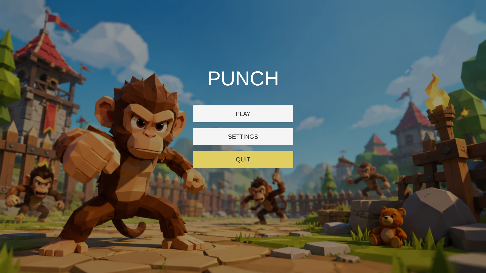
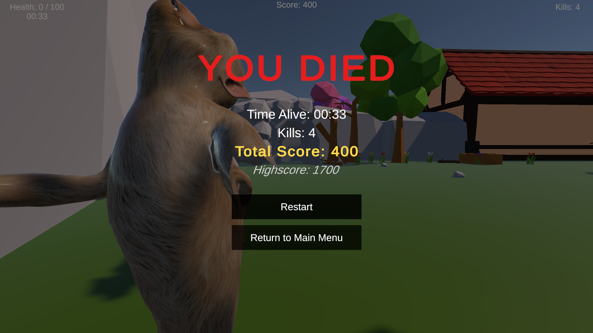
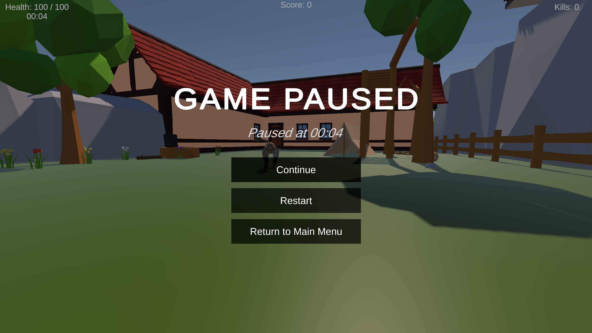
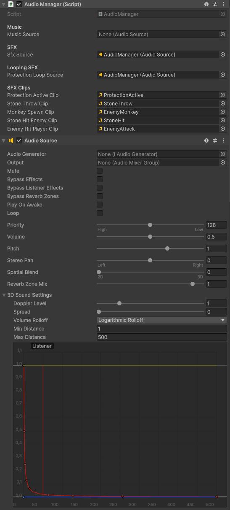
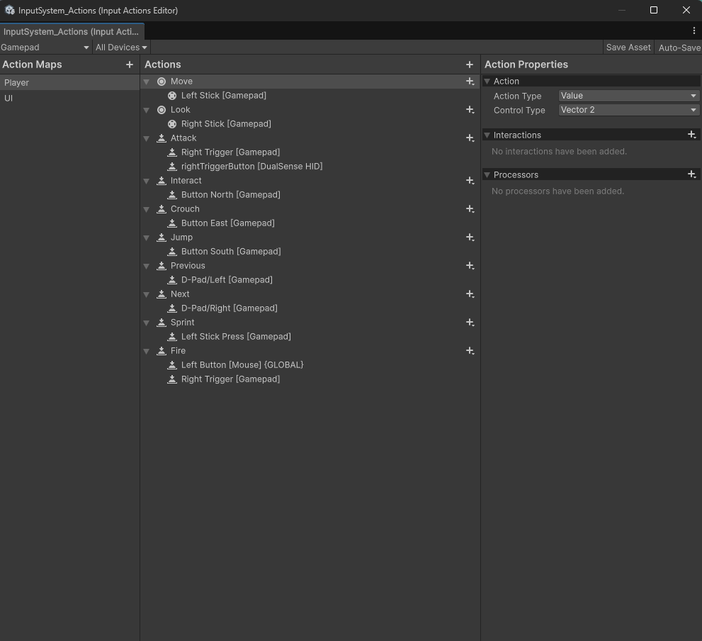
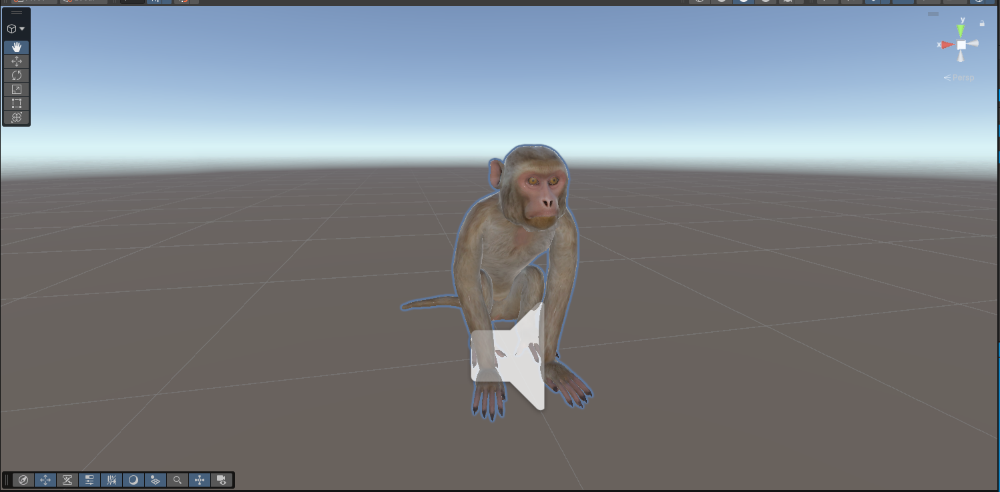

# Punch - Milestone 3 Development Report

## Introduction

In this final development milestone before release, we focused on making *Punch* feel more like a complete game. Earlier milestones were mainly about building the core mechanics, such as stone throwing, enemy chasing, health, and the teddy bear protection system. In this milestone, we worked more on game flow, feedback, audio, controls, and polish.

The game now has a proper start and end structure with a main menu, pause menu, and death screen. We also added sound effects and music to make the gameplay feel more responsive and alive.

---

## Main Menu, Pause Menu, and Death Screen

One of the biggest changes was adding proper scene and menu flow. The game now starts in a main menu scene where the player can start the game or quit. A settings button has also been added, but the settings menu is not fully implemented yet. This keeps the menu open for future improvements without making it too fixed.

During gameplay, the player can pause the game and choose to resume, restart, or return to the main menu. We also added a death screen that appears when the player's health reaches zero. From this screen, the player can restart the game or return to the main menu.

---

## Sound Effects and Music

This milestone also added the first full audio pass for the game. Previously, the game had no sound, which made the gameplay feel quite empty. We added sound effects for important player actions and game events, such as throwing a stone, hitting an enemy, enemies hitting the player, and picking up power-ups.

We also added walking sounds for both the player and enemy monkeys. The player footsteps are louder and clearer, while the enemy footsteps are kept lower so they support the atmosphere without becoming too distracting. The teddy bear protection barrier now has a looping sound while it is active, which makes it easier for the player to notice when the effect is running. A background music track was also added to the main menu.

### Features implemented

- Main menu background music
- Player footstep sounds
- Enemy footstep sounds
- Stone throw sound
- Stone hitting enemy sound
- Enemy hitting player sound
- Protection barrier loop sound

---

## Controller and Arcade Input Testing

Since the game is intended for the VIA Arcade machine, we also worked on controller support. We implemented and tested gamepad controls using a DualSense controller. Movement, camera control, jumping, throwing, and interaction were verified with the controller.

We planned to test the game directly on the arcade machine, but the arcade controls were not responsive during testing because they were not connected at the time. Because of this, we could not fully confirm the arcade input setup, but we prepared the input system so it can support the arcade layout later. The arcade uses two sticks, where one can be used for movement and the other for looking around.

---

## Spawning and Visual Improvements

We also improved how objects spawn in the play area. The teddy bear now has several possible spawn locations, so it does not always appear in the same place. Enemies also spawn from different positions, which makes the gameplay less predictable and creates more pressure for the player.

The enemy monkey model was also improved by adding textures. Earlier, the enemy model was mostly plain and unfinished-looking. With the added texture, the enemy is more readable and fits better with the visual style of the game.

---

## Challenges During Development

One challenge was making all the new systems work together without breaking the existing gameplay. For example, the pause and death screens needed to stop the game at the right time, while still allowing the player to restart or return to the main menu. The sound system also had to be connected to many different scripts, such as stone throwing, enemy damage, and player protection.

Another challenge was testing the arcade controls. Since the arcade machine controls were not connected, we had to verify the input system with a normal controller instead. This means the arcade setup still needs final testing when the machine is available.

---

## Reflection and Next Steps

This milestone made the game feel much more complete. The game now has a proper start, gameplay loop, and ending flow. The added audio also gives much better feedback to the player, especially when throwing stones, getting hit, or using the teddy bear protection.

For the final release blog post, we will focus on showing the finished version of the game, explaining the final gameplay experience, and reflecting on the project as a whole.

---

## Conclusion

Overall, this milestone completed many of the missing parts around the core gameplay. The main menu, pause menu, death screen, sound effects, music, controller support, improved spawning, and textured enemy model all helped move *Punch* closer to a finished arcade game. There are still improvements that could be made, especially with settings and final arcade testing, but the game now has the main systems needed for a playable final version.
